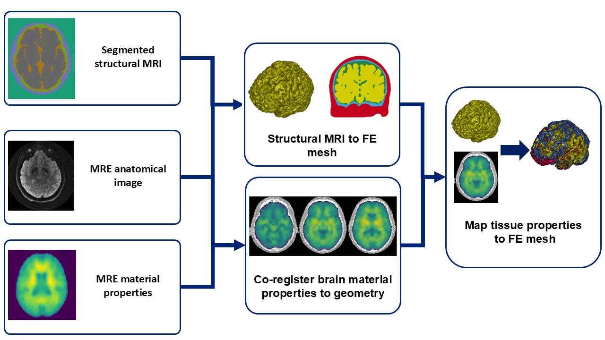

# Summary

Computational models of the human head are powerful tools for non-invasive analysis of the biomechanics of conditions such as traumatic brain injury, hydrocephalus, and stroke.  MRI2FE is a toolkit to facilitate the creation of finite element (FE) models of the human head from large-sample-size medical imaging datasets.  It enables the creation of computational head models with unique geometry from anatomical magnetic resonance images (MRIs) as well as unique material characteristics measured using magnetic resonance elastography (MRE).  The toolkit is designed to make it easy to convert a large structured dataset into a series of FE models which can be used in computational biomechanics analyses. 

The model generation process is shown in \autoref{fig1}.  There are four core operations handled by the toolkit: Mesh generation from a segmented MRI volume, calculation of viscoelastic material model parameters from MRE data, mapping of MRE data onto the MRI-derived mesh, and export to a format compatible with commercial FE solvers.  There are built-in pipelines to automate all steps of model generation, or they can be run separately to integrate additional processing steps using other Python tools.  MRI2FE integrates functions from standard toolkits for mesh generation [@cgal] and MRI manipulation [@antsx] into a single integrated workflow.  It is designed to be used in conjunction with other FE preprocessing software and toolkits to enable patient-specific biomechanical analysis for a variety of neurodegenerative conditions.  By combining these existing tools into a streamlined framework, MRI2FE lowers the barrier for new users in biomechanics to generate reliable models without needing to manually stitch together multiple software packages.



# Statement of need

FE head models have been developed previously from population averaged geometry  and material properties [@iwamoto2015;@gayzik2011]or in small numbers from patient-specific data [@alshareef2021;@fonville2022].  However, averaged models cannot be used to describe how a physical phenomenon such as brain movement during an impact will vary across the population with changes in head size, shape, and the material characteristics of the brain.  Furthermore, modeling of neurodegenerative conditions which result in altered geometry or material properties of the brain such as Alzheimer's Disease or Hydrocephalus requires a sample size of head models sufficient to cover the range of possible brain geometries and material properties.  

Efforts in open data sharing have produced large-sample-size MRI datasets for a variety of conditions.  However, there are no tools to automate the generation of computational models from such datasets.  MRI2FE facilitates the rapid generation of large quantities of computational head models derived from MRI and MRE datasets.  For instance, in the context of traumatic brain injury research, the toolkit can be employed to construct models from open datasets to investigate how variations in skull geometry contribute to injury risk.

The principal advantage of MRI2FE is its ability to minimize the boilerplate and manual intervention typically required for model creation, particularly when processing large MRI datasets with consistent data structures and parameters. This automation not only accelerates research timelines but also enhances reproducibility by reducing user-to-user variability in preprocessing steps.

# Example Workflow

All steps of the workflow can be executed at once using a single build script. The example below illustrates how MRI2FE can generate a FE model from MRI and MRE data, export it to a solver-ready format, and return a model object for further manipulation in Python:

```python
import MRI2FE

# define structural MRI paths
labeled_geom_path = "path/to/labeled_image.nii"
geom_roi_mask_path = "path/to/roi_mask.nii"

# define MRE geometry paths
MRE_geometry_paths = ["path/to/30Hzgeom.nii",
                      "path/to/50Hzgeom.nii",
                      "path/to/70Hzgeom.nii"]

MRE_mask_path = "/path/to/MRE_mask.nii"

# define a list of tuples containing the MRE data
# either stiffness/damping ratio or G'/G"
MRE_properties_paths = [
    ("path/to/30Hzstiffness.nii","path/to/30Hzdamping.nii"),
    ("path/to/50Hzstiffness.nii","path/to/50Hzdamping.nii"),
    ("path/to/70Hzstiffness.nii","path/to/70Hzdamping.nii")
]

# model builder workflow: returns model object and writes to output

mdl = (
    MRI2FE.FEModelbuilder()
    .mesh(img_path = labeled_geom_path,
          img_labels = ["region1","region2","region3"])
    .map_mre(target_label = 1,
             MRE_type = "stiffness_damping",
             MRE_geom = MRE_geometry_paths,
             MRE_mask = MRE_mask_path,
             MRE_frequency = [30,50,70],
             MRE_to_transform = MRE_properties_paths)
    .write("/output/path/example.k")
    .build()
)

```

# References
